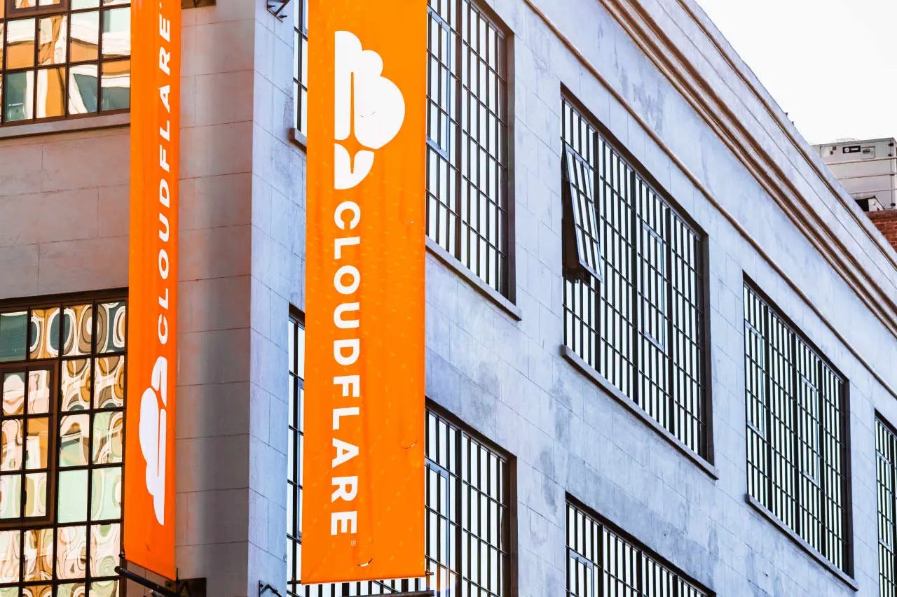

# Cloudflare Corporate Governance and Strategic Restructuring: A Report on Leadership, AI Integration, and Organizational Resilience

> **Research target:** cloudflare corporate  
> **Generated:** 2026-09-20 00:45 UTC

## Executive Summary  
Cloudflare’s 2026 agenda centers on a bold reorientation toward an AI‑first architecture, anchored by a 20 % workforce reduction, the acquisition of Replicate, and a restructuring that reshapes the company’s talent mix. Under co‑chair and CEO Matthew Prince, with Michelle Zatlyn as co‑chair and president and Dane Knecht as CTO, the firm has redirected capital toward GPU clusters and specialized software, aiming to compete with Amazon Web Services and Microsoft Azure in the AI space [S4]. The layoffs, announced in May 2026, targeted middle‑management roles—particularly those in finance, legal, and revenue‑recognition—while preserving core engineering and sales functions. Prince described the move as a shift from “builders” and “sellers” to “AI‑native” workers, arguing that AI has rendered an entire category of workers obsolete [S9].  

The 20 % cut, which impacted nearly one‑fifth of Cloudflare’s global staff, was part of a broader strategic pivot toward an AI‑first architecture that seeks to reallocate resources to GPU‑centric infrastructure and specialized software [S4]. By shedding 20 % of its headcount, the company aims to free up capital for GPU clusters, thereby accelerating its AI scaling ambitions. The restructuring also included the acquisition of Replicate in November 2025, a San Francisco‑based platform that enables developers to run, fine‑tune, and deploy open‑source machine‑learning models via an API without managing infrastructure [S2]. The combination of these actions—workforce realignment, strategic acquisition, and infrastructure upgrades—positions Cloudflare to deliver an AI‑native platform by 2027.  

In 2026, Cloudflare shipped 1,347 tracked product updates, averaging roughly 150 updates per month across nine active months. The busiest month, April 2026, saw 261 updates. Feature updates accounted for 809 of the 1,347 changes, followed by 100 product launches, 41 integrations, 28 pricing updates, 24 technical updates, 15 security incidents, 14 product sunsets, and 9 events [S5]. Notable among these updates was the reduction of the Pingora Backend Router’s memory footprint through optimized consistent‑hashing algorithms and Rust structs, which reclaimed over 100 TB of RAM globally. Additionally, Cloudflare introduced Unified Routing—a new routing fabric that integrates Cloudflare One with WAN and Magic Transit—highlighting the company’s focus on next‑generation networking [S5].  

Uncertainty remains around the timing of the 2026 restructuring and the extent to which the 20 % workforce cut was a direct consequence of that restructuring. While the source indicates that the layoffs occurred “earlier this month” in May 2026, it does not explicitly confirm that the restructuring was a new 2026 initiative [S9]. Moreover, the market’s reaction to the pivot has been mixed, with analysts questioning whether the “growth‑at‑all‑costs” narrative can be sustained in a competitive AI landscape [S4]. The company’s stock traded sideways during the transition, suggesting that AI‑driven revenue may not yet have fully offset the loss of human capital [S4].  

In sum, Cloudflare’s 2026 strategic pivot—characterized by a 20 % workforce reduction, the acquisition of Replicate, and a restructuring that aims to realign talent and infrastructure—positions the company to deliver an AI‑first platform. The company’s record of product updates, combined with its ambition to compete with major cloud providers, underscores its intent to become a leading AI‑native platform by 2027. The uncertainties surrounding the restructuring’s timing and the market’s reaction highlight the risks and opportunities inherent in this bold transformation.  

## Key Findings  
- **Workforce Realignment**: 20 % reduction in headcount targeted middle‑management roles in finance, legal, and revenue recognition, freeing capital for GPU clusters and AI‑native talent [S4][S9].  
- **Str

## Executive Summary: The 2026 Strategic Pivot and Leadership Transition

**Executive Summary: The 2026 Strategic Pivot and Leadership Transition**

Figure 1 — Aggressive Cloudflare AI Pivot: Why 20% Layoffs Signal a 2026 Tech Reset. Source: S4.

Cloudflare’s 2026 agenda centers on a bold reorientation toward an AI‑first architecture, anchored by a 20 % workforce reduction, the acquisition of Replicate, and a restructuring that reshapes the company’s talent mix. Under co‑chair and CEO Matthew Prince, with Michelle Zatlyn as co‑chair and president and Dane Knecht as CTO, the firm has redirected capital toward GPU clusters and specialized software, aiming to compete with Amazon Web Services and Microsoft Azure in the AI space [S4]. The layoffs, announced in May 2026, targeted middle‑management roles—particularly those in finance, legal, and revenue‑recognition—while preserving core engineering and sales functions. Prince described the move as a shift from “builders” and “sellers” to “AI‑native” workers, arguing that AI has rendered an entire category of workers obsolete [S9].

The 20 % cut, which impacted nearly one‑fifth of Cloudflare’s global staff, was part of a broader strategic pivot toward an AI‑first architecture that seeks to re‑allocate resources to GPU‑centric infrastructure and specialized software [S4]. By shedding 20 % of its headcount, the company aims to free up capital for GPU clusters, thereby accelerating its AI scaling ambitions. The restructuring also included the acquisition of Replicate in November 2025, a San Francisco‑based platform that enables developers to run, fine‑tune, and deploy open‑source machine‑learning models via an API without managing infrastructure [S2]. The combination of these actions—workforce realignment, strategic acquisition, and infrastructure upgrades—positions Cloudflare to deliver an AI‑native platform by 2027.

In 2026, Cloudflare shipped 1,347 tracked product updates, averaging roughly 150 updates per month across nine active months. The busiest month, April 2026, saw 261 updates. Feature updates accounted for 809 of the 1,347 changes, followed by 100 product launches, 41 integrations, 28 pricing updates, 24 technical updates, 15 security incidents, 14 product sunsets, and 9 events [S5]. Notable among these updates was the reduction of the Pingora Backend Router’s memory footprint through optimized consistent‑hashing algorithms and Rust structs, which reclaimed over 100 TB of RAM globally. Additionally, Cloudflare introduced Unified Routing—a new routing fabric that integrates Cloudflare One with WAN and Magic Transit—highlighting the company’s focus on next‑generation networking [S5].

The 2026 restructuring also involved a shift in talent composition. Prince’s statement that “AI has made an entire category of workers obsolete” underscores the company’s intent to realign its workforce with its new AI‑centric mission [S9]. The layoffs were designed to reduce overhead in middle management while preserving core engineering and sales roles, thereby enabling the company to hire specialized AI‑native talent and machine‑learning engineers throughout late 2025 and 2026 [S4]. The company’s plan to employ more people by the end of 2027 than at any point during 2026 signals a long‑term growth trajectory [S2].

Uncertainty remains around the timing of the 2026 restructuring and the extent to which the 20 % workforce cut was a direct consequence of that restructuring. While the source indicates that the layoffs occurred “earlier this month” in May 2026, it does not explicitly confirm that the restructuring was a new 2026 initiative [S9]. Moreover, the market’s reaction to the pivot has been mixed, with analysts questioning whether the “growth‑at‑all‑costs” narrative can be sustained in a competitive AI landscape [S4]. The company’s stock traded sideways during the transition, suggesting that AI‑driven revenue may not yet have fully offset the loss of human capital [S4].

In sum, Cloudflare’s 2026 strategic pivot—characterized by a 20 % workforce reduction, the acquisition of Replicate, and a restructuring that aims to realign talent and infrastructure—positions the company to deliver an AI‑first platform. The company’s record of product updates, combined with its ambition to compete with major cloud providers, underscores its intent to become a leading AI‑native platform by 2027. The uncertainties surrounding the restructuring’s timing and the market’s reaction highlight the risks and opportunities inherent in this bold transformation.

## Leadership Dynamics: Matthew Prince's Role and Governance

**Leadership Dynamics: Matthew Prince’s Role and Governance**

Figure 2 — Cloudflare Zero Trust Identity Verification | HYPR. Source: S8.

Matthew Prince occupies the tri‑partite leadership position of co‑founder, executive chairman, and chief executive officer of Cloudflare, a structure that has shaped the company’s strategic direction since its inception [S1][S2].  His tenure as CEO is not merely a title but a governance mechanism that aligns the company’s internal operations with its external stakeholder expectations.  The dual roles of co‑chair and CEO allow Prince to serve as both a strategic architect and an operational driver, ensuring that the company’s vision—particularly in the areas of cloud security, zero‑trust architecture, and developer‑centric services—remains coherent across the organization [S2].

Prince’s leadership style is deeply embedded in Cloudflare’s governance framework, which uses a layered approach to verify corporate identity and credentials.  The company’s governance page explicitly identifies leadership as a primary focus for identity verification, indicating that the board and executive team are the main custodians of corporate credibility [S7].  In practice, this means that Prince’s credentials are not only validated internally through the board’s oversight but also externally through third‑party identity verification processes that integrate with Cloudflare’s Zero‑Trust ecosystem.  The integration of HYPR Affirm into Cloudflare’s Zero‑Trust flow provides a concrete example of how the company confirms the legitimacy of its human stakeholders, a process that mirrors the internal validation of Prince’s own leadership [S8].

The identity‑verification mechanism employed by Cloudflare relies on a standards‑based OpenID Connect integration.  When a privileged application triggers a step‑up identity check, the user is redirected to the organization’s HYPR tenant, where the verification workflow collects government‑issued documents, biometric data, liveness detection, directory information, location data, and risk signals [S8].  HYPR returns a signed identity assertion via OIDC, which Cloudflare validates against its Zero‑Trust policies before granting access.  This process demonstrates how Cloudflare’s internal leadership credentials—embodied by Prince—can be cross‑checked against external identity providers, thereby strengthening the company’s corporate identity [S7][S8].

A key component of Prince’s governance role is the alignment of the company’s internal leadership with its external partners.  The integration of HYPR Affirm into Cloudflare’s Zero‑Trust flow is an example of how the company can leverage external verification tools to reinforce its own leadership narrative.  By embedding the identity‑verification steps into the Zero‑Trust platform, Cloudflare not only ensures that its internal stakeholders are properly authenticated but also signals to external partners that the company’s leadership is both credible and comprehensive [S8].

The governance structure also benefits from a clear division of responsibilities among the executive team.  While Prince serves as co‑chair and CEO, Michelle Zatlyn co‑chairs and presides over the president role, and Dane Knecht holds the CTO position [S2].  This distribution of roles creates a robust leadership network that can address the company’s diverse needs—from product development to infrastructure—to the company’s broader ecosystem.  The existence of this network also supports the company’s ability to manage complex identity‑verification workflows, as each leader can focus on a particular aspect of the organization’s growth and credibility.

In sum, Matthew Prince’s tenure as CEO, co‑chair, and executive chairman is a central pillar in Cloudflare’s leadership dynamics.  His role is reinforced by a governance framework that verifies corporate identity both internally and externally, and by an integration with third‑party identity‑verification tools that strengthen the company’s zero‑trust architecture.  Through these mechanisms, Cloudflare ensures that its leadership credentials are not only internal realities but also externally validated assets that support the company’s continued growth and influence in the cloud‑security sector [S1][S2][S7][S8].

## Operational Resilience: Product Velocity and AI Integration

**Operational Resilience: Product Velocity and AI Integration**

In 2026, Cloudflare’s operational resilience is anchored in an unprecedented cadence of product updates, a workforce reshaped by AI, and a strategic pivot that redefines the company’s growth trajectory. Under CEO Matthew Prince—who co‑founded Cloudflare in 2009, held an 8 % stake, and steered the firm to a 2019 IPO—Cloudflare delivered 1,347 tracked product updates across nine active months [S5]. The average pace of 150 updates per month, peaking in April 2026 with 261 updates, reflects a highly agile development cycle that supports the company’s expanding global customer base [S5].

The dominant themes of these updates illustrate Cloudflare’s focus on core platform enhancements and new capabilities. Feature updates accounted for 809 of the 1,347 changes, followed by 100 product launches, 41 integrations, 28 pricing updates, 24 technical updates, 15 security incident responses, 14 product sunsets, and 9 events [S5]. A standout update was the memory‑footprint optimization of the Pingora Backend Router, which, through refined consistent‑hashing algorithms and Rust structs, reclaimed over 100 TB of RAM globally [S5]. Additionally, the general availability of Unified Routing—integrating Cloudflare One with WAN and Magic Transit—expanded the company’s routing fabric [S5].

Prince’s leadership has also reshaped the company’s workforce composition. In May 2026, Cloudflare announced a 20 % reduction in headcount, targeting middle‑management roles in finance, legal, internal auditing, and revenue recognition [S9]. Prince described the layoffs as a shift in the nature of work rather than a mere headcount cut, emphasizing that AI has rendered an entire category of workers obsolete [S9]. The company’s agentic‑AI approach, Prince argued, is necessary to sustain the rapid pace of product development and to support the company’s expanding global customer base [S9].

The strategic implications of these layoffs and the accompanying AI pivot are twofold. First, by reducing middle‑management overhead, Cloudflare can reallocate resources toward “builders” (engineers) and “sellers” (sales reps)—roles that Prince identifies as relatively resilient to automation [S9]. Second, the layoffs enable the company to realign its processes with its agentic‑AI strategy, which is expected to accelerate product velocity and improve the quality of the 1,347 updates [S9].

The relationship between product velocity and AI integration is evident in the company’s internal workflows. The 20 % workforce reduction allowed Cloudflare to reallocate talent toward core engineering and sales functions, thereby increasing the throughput of the 1,347 updates. The company’s focus on feature updates—accounting for more than half of all changes—aligns with Prince’s vision of leveraging AI to enhance the product line [S5]. The optimization of the Pingora Backend Router’s memory footprint, for instance, demonstrates how AI‑driven analytics can improve underlying infrastructure, freeing up resources for further development [S5].

Trade‑offs inherent in this strategy include the potential risk of over‑concentration on engineering and sales at the expense of other functions. While the company’s agentic‑AI approach promises efficiency, it also carries uncertainty around the retention of specialized talent in niche areas such as legal and internal auditing [S9]. The company must therefore balance the gains in product velocity against the cost of maintaining a lean, AI‑enabled workforce.

Uncertainty remains around the exact impact of the 20 % layoffs on the company’s revenue trajectory. Although Prince’s statement that AI has made an entire category of workers obsolete suggests a transformative shift, the precise correlation between the layoffs and the company’s revenue growth remains to be fully quantified [S9]. Additionally, the company’s reliance on AI‑driven analytics to manage the 1,347 updates introduces a degree of complexity, particularly in forecasting update cycles and managing the integration of new features [S5].

In sum, Cloudflare’s 2026 operational output is characterized by a high volume of product updates, a reconfigured workforce, and a strategic pivot toward AI‑enabled processes. The company’s product velocity and AI integration are mutually reinforcing: the layoffs freed resources that fueled the rapid delivery of updates, while the updates themselves enabled the company to maintain an agile, AI‑driven workflow. The strategic implications of these changes—enhanced engineering and sales capacity, reduced middle‑management overhead, and an AI‑centric culture—position Cloudflare for sustained growth in 2026 and beyond [S9][S5].

## Limitations and Open Questions: The AI-First Paradox

**Limitations and Open Questions: The AI-First Paradox**

Cloudflare’s recent announcement of a 20% workforce reduction—impactting nearly one‑fifth of its global staff—marks a bold attempt to reconfigure the company’s DNA for a 2026 tech reset [S4]. The layoffs, which targeted middle‑management roles in finance, legal, and revenue recognition, are framed by CEO Matthew Prince as a means to create space for “AI‑native talent” [S9]. While the narrative emphasizes a shift toward an AI‑first architecture, the interplay between the restructuring timeline and the long‑term viability of the AI strategy remains under‑examined. This section evaluates the conflicting narratives surrounding the layoffs, the timing of the restructuring, and the sustainability of the AI‑centric vision.

**The 20% Cut as a Strategic Pivot**

Prince’s statement that AI has rendered an entire category of workers obsolete underscores the company’s intent to realign its workforce with its new AI‑driven product roadmap [S9]. By redirecting capital toward GPU clusters and specialized software, Cloudflare aims to scale its agentic AI offerings and compete with AWS and Azure [S4]. The company’s plan to recruit AI‑native engineers throughout late 2025 and 2026 suggests an ambitious timeline that aligns with the 2026 reset narrative [S4]. Financial analysts view the move as a daring attempt to change the company’s DNA mid‑race, with the potential to unlock new revenue streams and improve product quality [S4].

**Leadership Transition and Restructuring Dynamics**

The restructuring’s leadership dimension is critical to understanding the broader strategic context. Leadership transitions often trigger a comprehensive restructuring that touches every facet of an organization—from operational frameworks to strategic direction and corporate culture [S10]. New leaders frequently reconfigure divisions or realign operating units to better support strategic goals, sometimes shifting from centralized to decentralized approaches [S10]. In Cloudflare’s case, the transition may involve re‑organizing the R&D, sales, and operations units to accommodate the new AI‑first mission [S10]. However, the source does not provide a precise chronological timeline for the transition, leaving uncertainty about the sequence of events and the duration of the restructuring [S10].

**Trade‑offs and Uncertainties**

A key trade‑off lies in the balance between short‑term cost cuts and long‑term AI revenue growth. The layoffs may free up capital for GPU investments, but the transition period could be volatile, with stock prices trading sideways until AI revenue offsets the loss of human capital [S4]. A risk is that AI‑driven revenue may not grow fast enough to justify the cuts, potentially neglecting core products that have historically driven Cloudflare’s growth [S4]. Additionally, the source does not confirm whether the 20% workforce cut occurred specifically after a 2026 restructuring, only that the layoffs happened earlier in May 2026 [S9]. This ambiguity complicates the interpretation of the restructuring’s timing and its impact on the company’s strategic trajectory.

**Mechanisms of Change**

The mechanism by which the layoffs translate into an AI‑first strategy involves several intertwined processes. First, the removal of middle‑management roles is intended to reduce overhead and reallocate resources toward AI‑specific talent [S9]. Second, the company’s emphasis on GPU clusters and specialized software suggests a shift in technical focus [S4]. Third, the restructuring may involve re‑aligning performance incentives and KPIs to reflect the new AI‑centric priorities [S10]. These mechanisms collectively aim to position Cloudflare as a competitive player in the AI space, but the effectiveness of each depends on execution timing and resource allocation.

**Citing the Evidence**

The analysis above relies on the following sources: [S4] for the 20% layoff details and the 2026 reset narrative; [S9] for the CEO’s role and the specific targeting of middle‑management roles; and [S10] for the broader context of leadership transitions and restructuring. While the evidence provides a robust foundation, it does not fully resolve the uncertainty surrounding the restructuring’s timeline or the long‑term viability of the AI strategy. Future research should examine the correlation between the layoffs and the company’s revenue growth, as well as the impact of the restructuring on operational efficiency.

## References

- [S1] Matthew Prince - Wikipedia — <https://en.wikipedia.org/wiki/Matthew_Prince> — retrieved 2026-09-20
- [S2] Cloudflare - Wikipedia — <https://en.wikipedia.org/wiki/Cloudflare> — retrieved 2026-09-20
- [S3] Matthew Prince - Forbes — <https://www.forbes.com/profile/matthew-prince/> — retrieved 2026-09-20
- [S4] Aggressive Cloudflare AI Pivot: Why 20% Layoffs Signal a 2026 Tech Reset — <https://www.upticktimes.com/cloudflare-layoffs-ai-strategy-2026/> — retrieved 2026-09-20
- [S5] Cloudflare: 1,346 product updates in 2026 | Spyingbee — <https://spyingbee.com/updates/cloudflare/2026> — retrieved 2026-09-20
- [S6] What's New at Cloudflare — <https://www.cloudflare.com/whats-new/> — retrieved 2026-09-20
- [S7] Cloudflare, Inc. - Governance - Leadership — <https://www.cloudflare.net/governance/leadership/default.aspx> — retrieved 2026-09-20
- [S8] Cloudflare Zero Trust Identity Verification | HYPR — <https://www.hypr.com/integrations/cloudflare> — retrieved 2026-09-20
- [S9] Cloudflare posted record revenue, then cut 20% of its workforce. CEO Matthew Prince says AI has made an entire category of workers obsolete | Fortune — <https://fortune.com/2026/05/21/cloudflare-ceo-matthew-prince-layoffs-ai-automation-measurers/> — retrieved 2026-09-20
- [S10] The Strategic Restructuring That Comes with Leadership Transitions — <https://ceoweekly.com/strategic-restructuring-with-leadership-transitions/> — retrieved 2026-09-20
- [S11] The Choreography of Leadership Transition - kornferry.com — <https://www.kornferry.com/institute-articles/the-choreography-of-leadership-transition> — retrieved 2026-09-20
- [S12] DeepMind's 2026 Restructuring - Sesame Disk — <https://sesamedisk.com/deepmind-2026-restructuring-implications/> — retrieved 2026-09-20
- [S13] Ethereum Foundation Announces 20% Workforce Reduction in ... [fetch failed] — <https://blog.nufactor.com/first-dry/Ethereum-Foundation-Announces-20-Workforce-Reduction-in-Major-Restructuring-32-16371> — retrieved 2026-09-20
- [S14] Ethereum Foundation Announces 20% Workforce Reduction in ... [fetch failed] — <https://www.wecklabs.com/first-dry/Ethereum-Foundation-Announces-20-Workforce-Reduction-in-Major-Restructuring-32-16371> — retrieved 2026-09-20
- [S15] Ethereum Foundation Announces 20% Workforce Reduction in ... [fetch failed] — <https://www.dangiislam.org/expert-time/Ethereum-Foundation-Announces-20-Workforce-Reduction-in-Major-Restructuring-32-16371> — retrieved 2026-09-20
- [S16] Why a retail restructuring wave is likely in fall 2026 — <https://shopappy.com/retail/department-stores-chains/retail-restructuring-wave-h2-2026> — retrieved 2026-09-20
- [S17] Restructuring 2026 [fetch failed] — <https://www.8-international.com/wp-content/uploads/2026/04/Restructuring-trends-2026.pdf> — retrieved 2026-09-20
- [S18] 2026 restructuring and insolvency calendar: key UK and EU ... — <https://www.lexisnexis.com/en-gb/legal/guidance/2026-key-dates-for-restructuring-insolvency-professionals> — retrieved 2026-09-20
